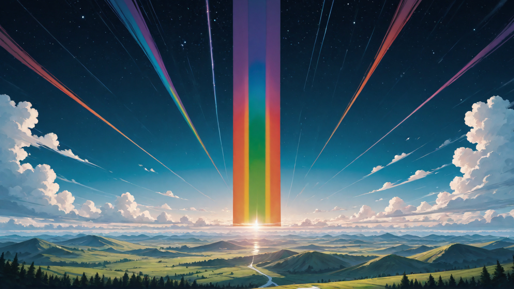
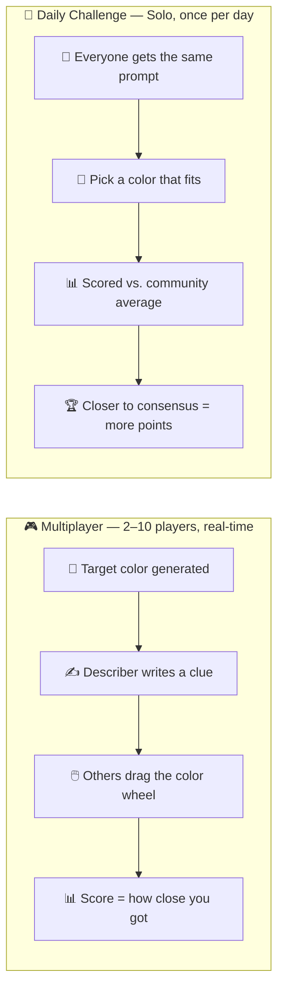
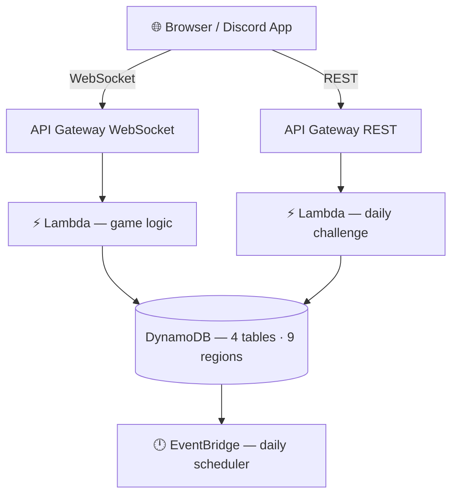
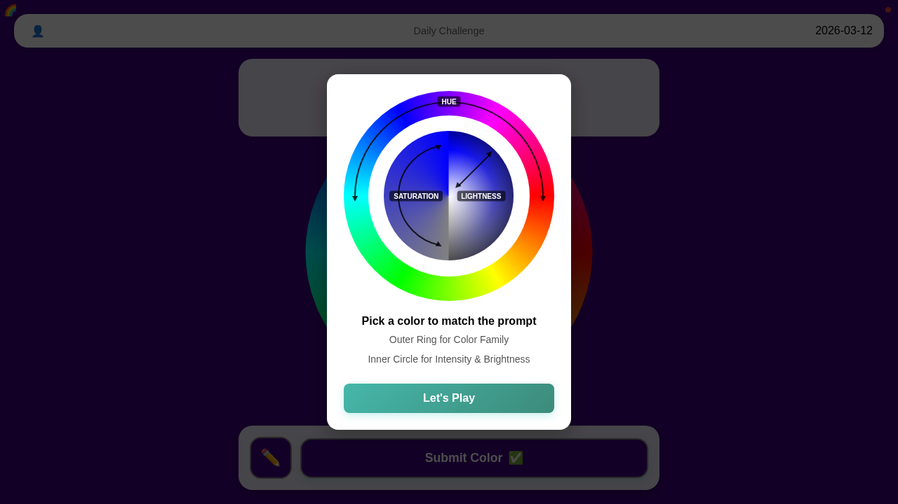
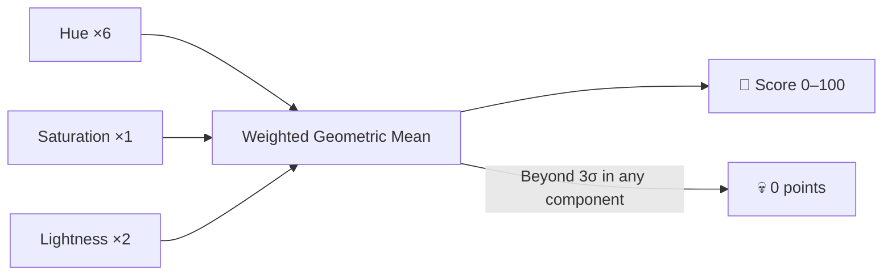
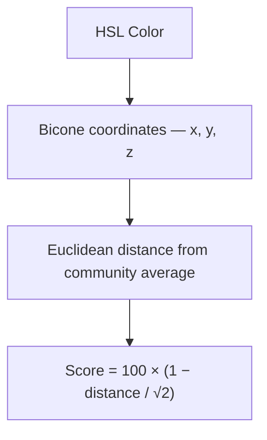
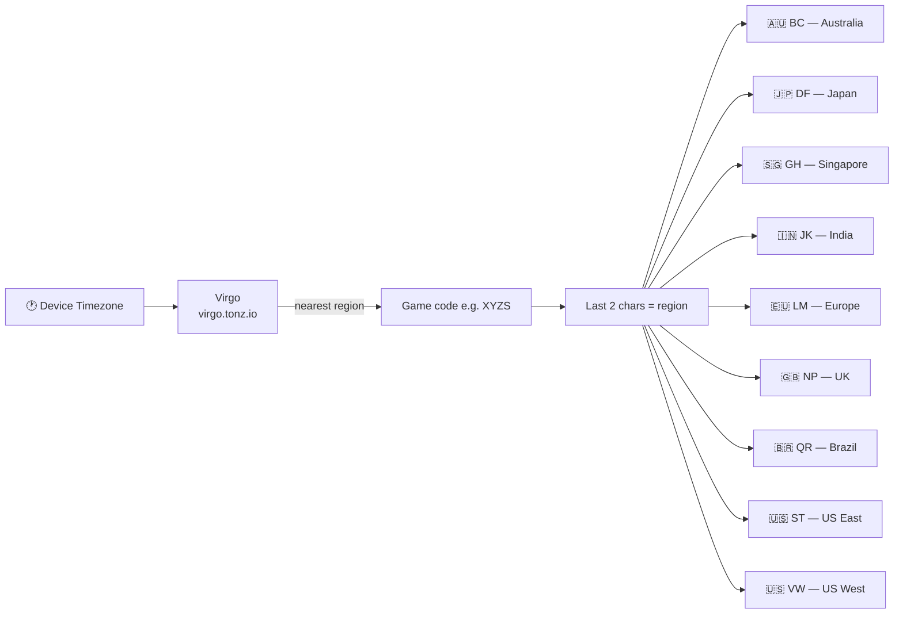
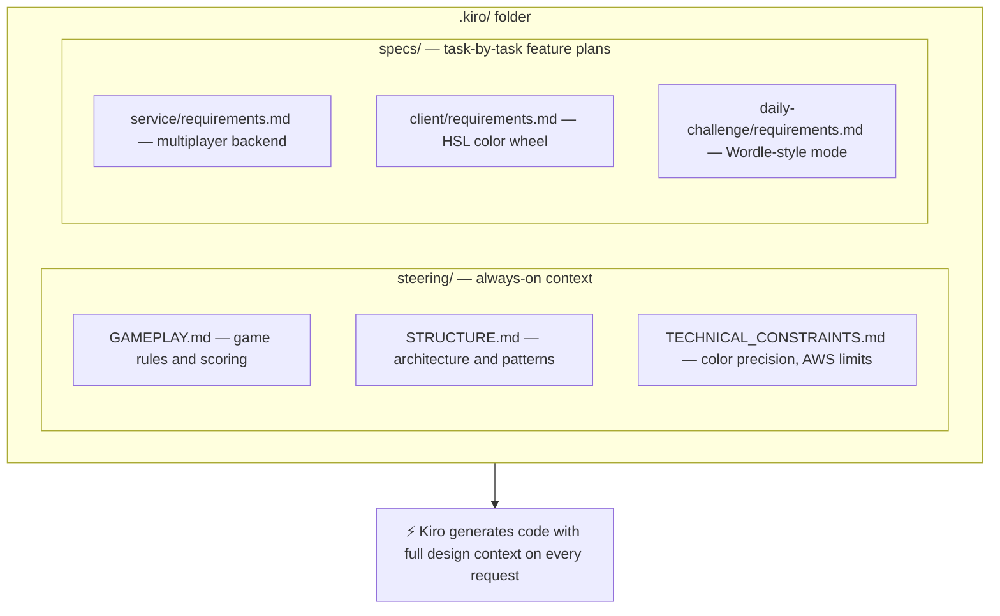

# On the Spectrum — Demo Guide

> 🎮 **[rgb.mcteamster.com](https://rgb.mcteamster.com)** · 5-minute talk · Built in 1 week with Amazon Kiro

---

## 1. The Game

**One sentence:** Describe a color in 50 characters — can your friends guess it?

### Two Modes

### Live Demo Flow *(3 min)*

1. Open [rgb.mcteamster.com](https://rgb.mcteamster.com) → **Create Game**
2. Share the 4-letter code — players join from anywhere
3. Round starts — the describer sees a target color and types a clue
4. Everyone drags the wheel; you can watch each other's selections move live
5. Reveal — target appears, scores calculated
6. Switch to **Daily Challenge** — show the prompt, pick a color, see the community average

---

## 2. Technology

### Architecture

### The Color Wheel

A custom-engineered HTML5 Canvas picker — not a library.

> **Live demo** — show the color wheel in action.

### Scoring

**Multiplayer** — geometric normal distribution, weighted by HSL component:

**Daily Challenge** — Euclidean distance through the HSL double cone:

HSL is mapped to a 3D double cone (bicone) so that distances between colors are perceptually uniform:

The community average is updated in real-time using **Welford's online algorithm** — no need to store every submission.

### 9 Regions, One Game Code

The last two characters of every game code encode the AWS region. Region selection is handled by **[Virgo](https://virgo.tonz.io)** ([mcteamster/virgo](https://github.com/mcteamster/virgo)) — a lightweight browser library that picks the nearest server from the player's device timezone, with no GPS, no IP lookup, and no external requests.

---

## 3. Built with Amazon Kiro

### What Is Kiro?

[Amazon Kiro](https://kiro.dev) is an AI-powered IDE that introduces **spec-driven development** — you write structured requirements first, and Kiro uses them as persistent context for every code generation request.

### How It Worked

**Steering docs** — Kiro reads these before every task. Game rules, scoring weights, and architectural decisions are never forgotten between sessions.

**Spec docs** — each feature is planned as numbered tasks with explicit acceptance criteria before a line of code is written.

### What Kiro Built

| Feature | Time |
|---------|------|
| CDK stack + DynamoDB tables | Hours |
| WebSocket game logic (13 actions) | Hours |
| Custom color wheel (Canvas) | Hours |
| Daily challenge (5 Lambdas + REST API + UI) | ~2 days |
| **Total** | **~1 week** |

### Human vs Kiro

| Human | Kiro |
|-------|------|
| Game design and rules | Implemented the rules in code |
| Scoring algorithm math | Implemented the algorithm |
| UX decisions | Built the components |
| Spec writing | Followed the spec |
| Playtesting and balance | Generated consistent output |

> **The spec is the contract.** When output was wrong, the fix was almost always in the spec — not the code.

---

## Quick Reference

| | |
|--|--|
| **Play** | [rgb.mcteamster.com](https://rgb.mcteamster.com) |
| **Repo** | [github.com/mcteamster/rgb](https://github.com/mcteamster/rgb) |
| **Stack** | React · TypeScript · AWS CDK · Lambda · DynamoDB |
| **Regions** | 9 AWS regions |
| **Built in** | ~1 week · Amazon Kiro · re:Invent 2025 |
